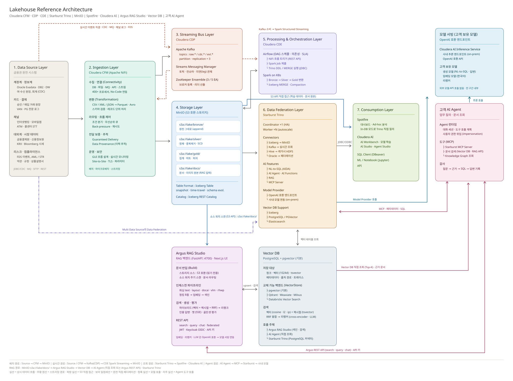

# modern-lakehouse-architecture-airgap

폐쇄망(air-gapped) 환경을 전제로 한 금융권 Modern Lakehouse 참조 아키텍처 다이어그램과
설계 문서입니다.



상자 안 텍스트를 기능 타일로 줄인 간략판은 [아래](#기능-개요도-간략판)에 따로 있습니다.

## 목차

- [구성](#구성)
- [아키텍처 개요](#아키텍처-개요)
- [기능 개요도 (간략판)](#기능-개요도-간략판)
- [다이어그램 재생성](#다이어그램-재생성)
  - [PNG 렌더러](#png-렌더러)
- [폰트](#폰트)
- [용어집](#용어집)
  - [환경·구조](#환경구조)
  - [제품](#제품)
  - [기타](#기타)

## 구성

```
.
├── assets/
│   ├── lakehouse-architecture-lr.svg     상세도 SVG (빌드 산출물)
│   ├── lakehouse-architecture-lr.png     상세도 PNG (빌드 산출물)
│   ├── lakehouse-concept.svg             기능 개요도 SVG (빌드 산출물)
│   └── lakehouse-concept.png             기능 개요도 PNG (빌드 산출물)
├── docs/
│   ├── architecture.md                   Layer별 설명과 경로 설계 근거
│   ├── architecture-rationale.md         제안 아키텍처의 특징과 선택 근거
│   ├── solutions.md                      솔루션별 역할과 담당 범위
│   ├── solution-features.md              솔루션별 주요 기능 목록 (공식 문서 기준)
│   ├── solution-feature-tables.md        솔루션별 기능표 (제품당 10행 · 검토 포인트 포함)
│   ├── solution-runtimes.md              솔루션별 동작 환경과 배포 방식
│   └── agent-readiness-analysis.md       Agent 대상 데이터 제공 요건 분석
└── scripts/
    ├── generate_architecture_svg.py      상세도 생성 스크립트
    └── generate_concept_svg.py           기능 개요도 생성 스크립트 (상세도의 팔레트·경로·렌더러 공유)
```

## 아키텍처 개요

좌에서 우로 흐르는 7개 Layer 구조입니다.

| # | Layer | 제품 |
|---|---|---|
| 1 | Data Source | 계정계·정보계, 카드·결제, 채널, 대외계·시장, 리스크·컴플라이언스 |
| 2 | Ingestion | Cloudera CFM (Apache NiFi) |
| 3 | Streaming Bus | Cloudera CDP — Kafka, Streams Messaging Manager, ZooKeeper |
| 4 | Storage | MinIO (S3 호환) + Apache Iceberg |
| 5 | Processing & Orchestration | Cloudera CDE — Airflow, Spark on Kubernetes |
| 6 | Data Federation | Starburst Trino |
| 7 | Consumption | Spotfire, Cloudera AI, SQL Client, Notebook |
| + | RAG | [Argus RAG Studio](https://github.com/DataDynamics-OSS/argus-rag-studio) — 인제스천 파이프라인 · 하이브리드 검색 · 생성 · 평가 · REST API |
| + | Data Catalog | [Argus Catalog](https://github.com/DataDynamics-OSS/argus-catalog) — 메타데이터 · 리니지 · 품질 · API/AI Agent 카탈로그 · 모델 레지스트리 |
| + | Vector DB | PostgreSQL + pgvector (기본), Qdrant · Weaviate · Milvus 교체 가능 |
| + | 모델 서빙 | Cloudera AI Inference Service (OpenAI 호환) + 고객 보유 모델 |
| + | AI Agent | 고객 AI Agent — Starburst MCP 도구, 권한 위임, 감사 |

제품 선택의 근거는 [docs/architecture-rationale.md](docs/architecture-rationale.md)에
정리했습니다.

상세 설명은 [docs/architecture.md](docs/architecture.md), 각 솔루션이 이 아키텍처에서
담당하는 역할은 [docs/solutions.md](docs/solutions.md), 공식 문서에서 확인한 제품별 기능
목록은 [docs/solution-features.md](docs/solution-features.md), 제품마다 표 하나로 합친
기능표는 [docs/solution-feature-tables.md](docs/solution-feature-tables.md), 동작 환경과 배포 방식은
[docs/solution-runtimes.md](docs/solution-runtimes.md)를 참고하십시오.

## 기능 개요도 (간략판)

위 상세도는 상자마다 사양 수준의 텍스트가 들어 있어 처음 보는 사람에게는 밀도가
높습니다. 간략판은 **배치 · 색 · 경로 구조를 상세도와 똑같이** 두고, 상자 안을
"기능명 + 한 줄 설명" 타일로 정리한 그림입니다. 구성요소가 무엇을 하는지 먼저
파악한 뒤 상세도로 넘어가는 용도입니다.


- 상자 위치와 경로가 상세도와 1:1로 같으므로 두 그림을 번갈아 봐도 헷갈리지 않습니다
- 타일 하나가 상세도의 그룹(굵은 소제목) 하나에 대응합니다
- 경로 라벨은 핵심어만 남겼습니다. 설계 근거는 [docs/architecture.md](docs/architecture.md)의
  경로 표를 참고하십시오

```bash
python scripts/generate_concept_svg.py
```

## 다이어그램 재생성

Python 3.10 이상이 필요합니다. SVG 생성 자체에는 외부 의존성이 없고, PNG 래스터화에만
시스템에 설치된 렌더러를 사용합니다.

```bash
python scripts/generate_architecture_svg.py
```

SVG와 PNG가 항상 함께 생성됩니다.

```
assets/lakehouse-architecture-lr.svg    벡터 (문서 삽입 · 확대)
assets/lakehouse-architecture-lr.png    래스터 4360 x 3340 (발표자료 · 이슈 첨부)
```

개념도는 `scripts/generate_concept_svg.py` 로 따로 생성하며 옵션은 같습니다
(`assets/lakehouse-concept.svg` · `.png` 4360 x 2720).

| 옵션 | 설명 |
|---|---|
| `-o`, `--output` | SVG 출력 경로 (기본 `assets/lakehouse-architecture-lr.svg`) |
| `--png` | PNG 출력 경로 (기본: SVG와 같은 이름의 `.png`) |
| `--png-width` | PNG 가로 픽셀 (기본 4360 = 캔버스 폭의 2배) |
| `--no-png` | PNG 없이 SVG만 생성 |

```bash
python scripts/generate_architecture_svg.py -o /tmp/diagram.svg --png-width 2180
```

레이아웃, 문구, 색상은 스크립트 상단의 `BOXES`, `EDGES`, `PALETTE` 선언에 모여 있습니다.
`assets/` 의 SVG와 PNG는 빌드 산출물이므로 직접 편집하지 말고 스크립트를 수정한 뒤
재생성하십시오.

### PNG 렌더러

다음 순서로 탐색해 먼저 발견되는 것을 사용합니다.

| 순위 | 렌더러 | 설치 |
|---|---|---|
| 1 | `rsvg-convert` | librsvg. 폐쇄망에서 가장 구하기 쉽습니다 |
| 2 | `inkscape` | |
| 3 | `chromium` / `chrome` | |
| 4 | CairoSVG | `python -m pip install cairosvg` |
| 5 | ImageMagick | `magick` 또는 `convert` |

하나도 없으면 SVG는 생성한 뒤 PNG 단계에서 안내 메시지와 함께 종료 코드 1로 끝납니다.
SVG만 필요하면 `--no-png` 를 사용하십시오.

실행 파일이 `PATH` 에 없으면 `SVG_RENDERER` 환경 변수로 직접 지정할 수 있습니다.

```bash
SVG_RENDERER=/opt/chromium/chrome python scripts/generate_architecture_svg.py
```

다이어그램에 한글이 포함되므로, **렌더러가 실행되는 환경에 한글 폰트가 설치되어 있어야**
합니다. 폰트가 없으면 PNG에서 한글이 빈 사각형으로 표시됩니다.

## 폰트

SVG는 `Pretendard → Malgun Gothic → Apple SD Gothic Neo → Noto Sans KR` 순으로 폰트를
탐색합니다. 한글이 깨지는 환경에서는 스크립트의 `FONT_STACK` 상수를 수정하십시오.

## 용어집

이 문서에 등장하는 용어입니다. Layer별 상세 설명은
[docs/architecture.md](docs/architecture.md), 제품 기능은
[docs/solution-features.md](docs/solution-features.md)를 참고하십시오.

### 환경·구조

| 용어 | 설명 |
|---|---|
| 폐쇄망 (air-gapped) | 외부 인터넷과 물리적·논리적으로 분리된 망. 외부 서비스 호출과 온라인 패키지 설치가 불가하므로, 모든 구성요소를 내부에 배치하고 설치 미디어를 반입해 공급해야 합니다 |
| Lakehouse | 데이터 레이크의 저비용 대용량 저장과 데이터 웨어하우스의 테이블·트랜잭션 특성을 한 저장소에서 함께 제공하는 아키텍처 |
| Layer | 이 아키텍처의 논리 구획 단위. 좌에서 우로 Data Source → Ingestion → Streaming Bus → Storage → Processing & Orchestration → Data Federation → Consumption 7개로 구성됩니다. 하단의 Argus Catalog · Argus RAG Studio · Vector DB와 우측의 모델 서빙 · AI Agent는 이 7개 Layer를 뒷받침하는 부속 구성요소입니다 |
| 계정계 · 정보계 | 금융 IT의 전통적 구분. 계정계는 예금·여신 등 거래를 처리하는 원장 시스템, 정보계는 계정계 데이터를 분석 목적으로 재구성한 시스템 |
| 대외계 | 금융결제원, 신용정보원 등 외부 기관과 전문을 주고받는 시스템 |

### 제품

| 용어 | 설명 |
|---|---|
| Cloudera CFM | Cloudera Flow Management. Apache NiFi 기반의 데이터 수집·흐름 관리 제품 |
| Apache NiFi | GUI로 데이터 흐름을 설계하고 전달을 보증하는 데이터 통합 도구 |
| Cloudera CDP | Cloudera Data Platform. 이 아키텍처에서는 Kafka 중심의 스트리밍 구성요소를 가리킵니다 |
| Apache Kafka | 분산 이벤트 스트리밍 플랫폼. 생산자와 소비자를 시간적으로 분리하는 버퍼 역할 |
| Streams Messaging Manager (SMM) | Kafka의 토픽·컨슈머·지연을 관제하는 Cloudera 운영 도구 |
| ZooKeeper | 분산 코디네이션 서비스. Kafka 브로커 등록과 리더 선출에 사용 |
| MinIO | S3 호환 오브젝트 스토리지. 폐쇄망에 오브젝트 저장소를 자체 구축할 때 사용합니다 |
| Apache Iceberg | 오브젝트 스토리지 위에서 스냅샷·스키마 변경·트랜잭션을 지원하는 테이블 포맷 |
| Cloudera CDE | Cloudera Data Engineering. Airflow와 Spark on Kubernetes를 제공하는 데이터 처리·오케스트레이션 제품 |
| Apache Airflow | DAG로 작업 의존성과 일정을 정의하는 워크플로 오케스트레이터 |
| Spark on Kubernetes | Apache Spark를 Kubernetes 위에서 실행하는 배포 방식. 작업 단위로 자원을 할당·회수합니다 |
| Starburst Trino | 분산 SQL 질의 엔진 Trino의 상용 배포판. 여러 저장소를 하나의 SQL 네임스페이스로 묶습니다 |
| Spotfire | 시각화 기반 분석 플랫폼. 대시보드와 Ad-hoc 분석에 사용 |
| Cloudera AI | 모델 학습·서빙과 AI 에이전트를 제공하는 Cloudera 제품 |
| Argus RAG Studio | RAG 파이프라인의 구축·검색/생성·평가·운영·배포를 한 곳에서 다루는 Data Dynamics의 오픈소스 플랫폼 (Apache-2.0). FastAPI 백엔드와 Next.js UI, 에이전트 기반 원격 배포로 구성 |
| Argus Catalog | DataHub 스타일 데이터 카탈로그와 Unity Catalog 호환 ML 모델 레지스트리를 하나로 묶은 Data Dynamics의 오픈소스 메타데이터 플랫폼 (Apache-2.0). 폐쇄망을 전제로 설계 |
| pgvector | PostgreSQL에 벡터 타입과 유사도 인덱스(HNSW 등)를 추가하는 확장. Argus RAG Studio의 기본 벡터 저장소 |
| Elasticsearch | 문서 검색 엔진. 한국어 형태소 분석(Nori)과 kNN 벡터 검색을 함께 제공합니다 |

### 기타

| 용어 | 설명 |
|---|---|
| S3 호환 | AWS S3의 API 규격을 그대로 따르는 것. 애플리케이션 변경 없이 저장소를 교체할 수 있습니다 |
| 빌드 산출물 | 스크립트가 생성하는 파일. 직접 편집하지 않고 생성 스크립트를 수정한 뒤 재생성합니다 |
| SVG | 확대해도 깨지지 않는 벡터 이미지 형식. 이 저장소의 다이어그램 형식입니다 |
| rsvg-convert · Inkscape | SVG를 PNG 등 래스터 이미지로 변환하는 도구 |
| 폰트 스택 | 폰트를 우선순위대로 나열한 목록. 앞의 폰트가 없으면 다음 폰트를 사용합니다 |
| Ad-hoc 분석 | 미리 정의된 보고서가 아니라, 그때그때 질문에 따라 즉석으로 수행하는 분석 |
| RAG | Retrieval-Augmented Generation. 질문과 관련된 문서를 검색해 근거로 제공한 뒤 답변을 생성하는 방식 |
| 청킹 (chunking) | 긴 문서를 검색 단위로 잘라내는 것. 조각마다 출처와 메타데이터를 붙입니다 |
| 임베딩 (embedding) | 텍스트를 의미를 담은 숫자 벡터로 변환하는 것. 유사도 검색의 기준값이 됩니다 |
| Vector DB | 임베딩 벡터와 메타데이터를 저장하고 유사도 검색을 제공하는 저장소 |
| Top-K 검색 | 질의 벡터와 가장 가까운 K개의 청크를 찾아 반환하는 검색 |
| 리니지 (lineage) | 데이터가 어디서 와서 어떤 처리를 거쳐 어디로 가는지의 계보. 컬럼 수준까지 추적하면 영향 분석과 감사 재현에 쓸 수 있습니다 |
| Query Listener | Trino의 EventListener SPI로 실행된 질의의 입출력 테이블·컬럼을 받아 리니지를 만드는 Argus Catalog 확장 |
| URN | Uniform Resource Name. Argus Catalog가 데이터셋·API·모델 같은 자산을 식별하는 고유 이름 |
